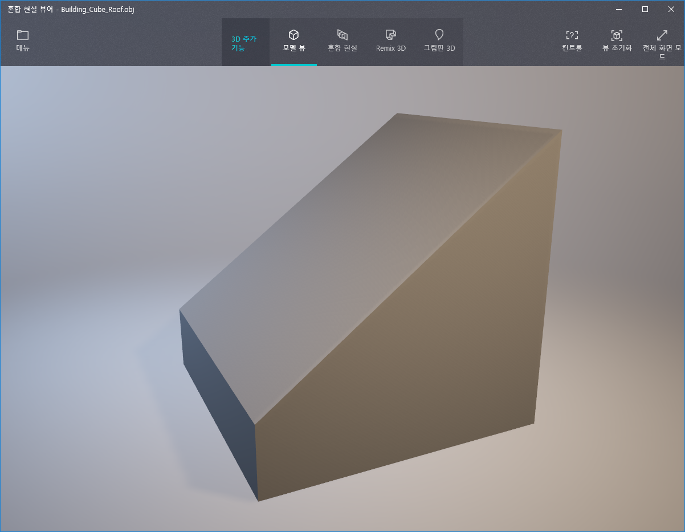
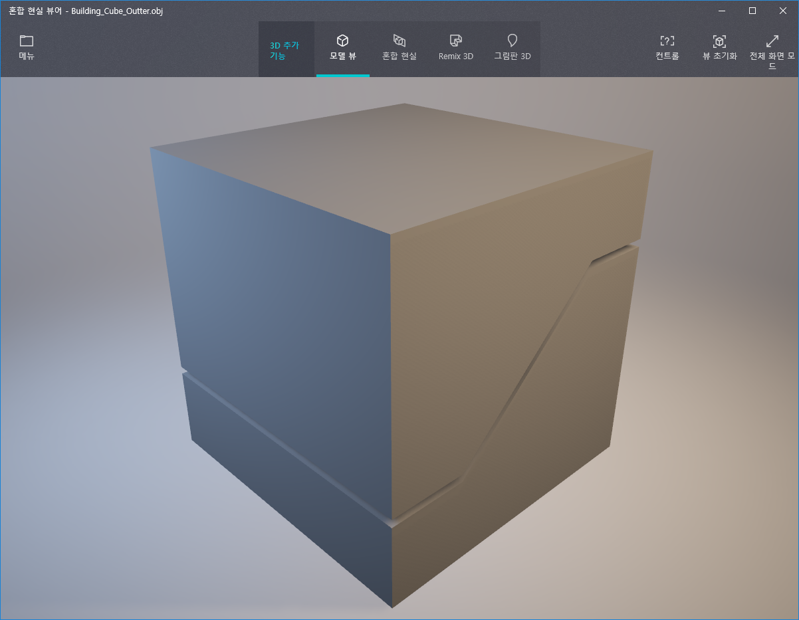
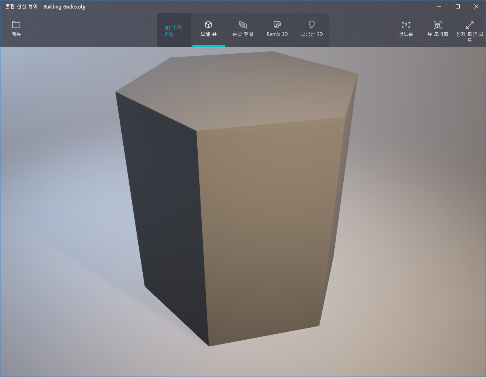
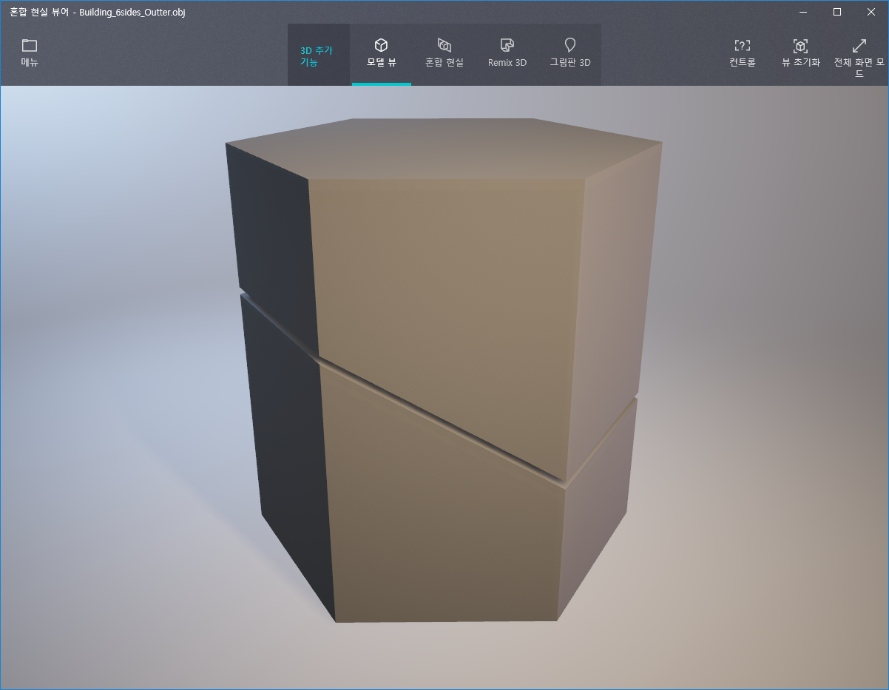
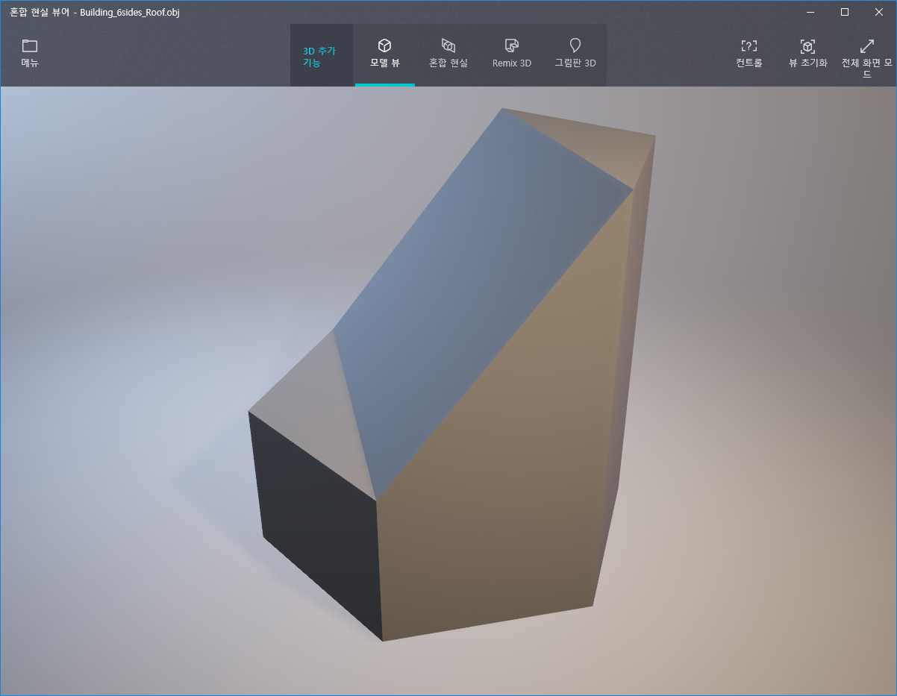
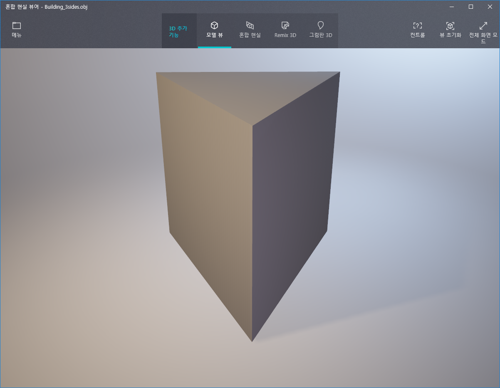
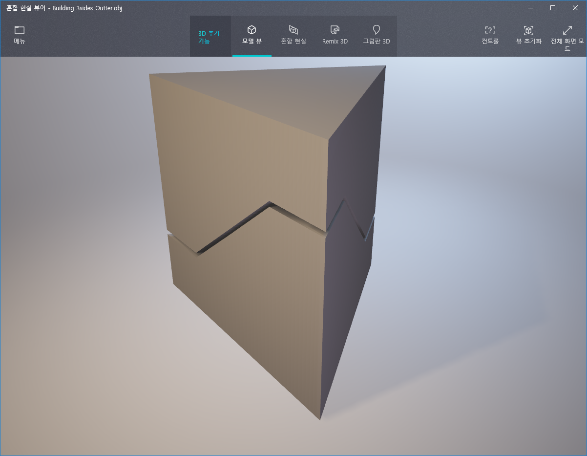
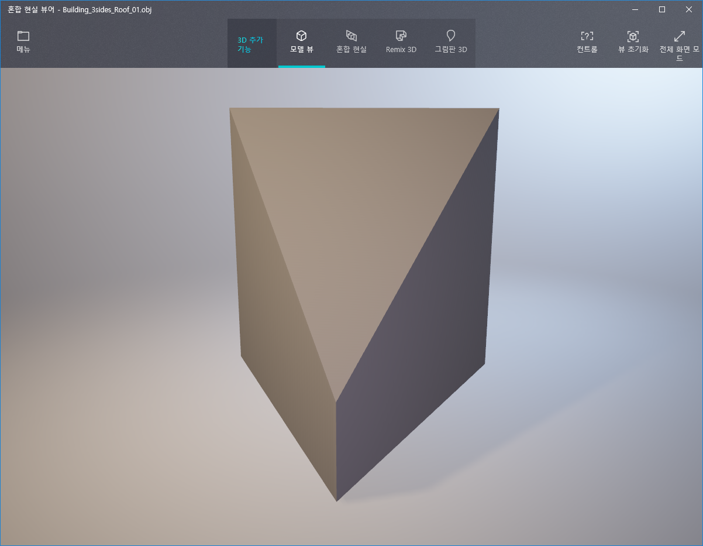
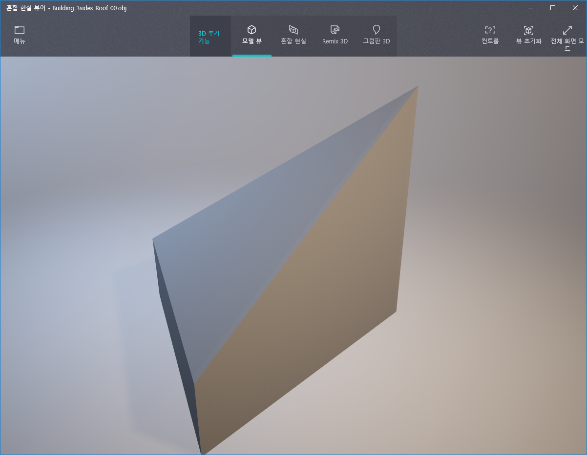

# CIS 566 Project 5: Shape Grammar

* Univer sity of Pennsylvania
* pennkey : byumjin
* name : [Byumjin Kim](https://github.com/byumjin)

## Live Demo

* [WebGL Link](https://byumjin.github.io/TronCity/)

- Volume up!
- It may take a few seconds to create thousands buildings.

### GUI
- Iteration : Iteration counter.
- MapSize : The size of one side of the city ground's grid.
- DensePopulationCap : Threshold of high population.

### Used basic mehses (blocks)

| Cube | Cube Cap | Cube Roof |
| --- | --- | --- |
|  | | |

| HexaCube | HexaCube Cap | HexaCube Roof |
| --- | --- | --- |
|  | | |

| TriCube | TriCube Cap | TriCube Roof 01 | TriCube Roof 02 |
| --- | --- | --- | --- |
|  | | | |

### Rules

I have omitted to describe the very detail parts of these rules below because they are complicated and impede to understand them.  

* Add Road : Object -> Add {BaseRoad(scaled x, scaled y, scaled z), SideLight01(scaled x, scaled y, scaled z), SideLight02(scaled x, scaled y, scaled z)}, terminal = true
* Add Deco : Object -> Add {Object( x,  y,  z), Repeat("X" | "Z", Random Number) {DecoObj(scaled x, scaled y, scaled z)} }, terminal = true
* Add Outter : Object -> Add outter, Add Deco or not, terminal = true
* Add Children : Object -> Subdivide(Object), terminal = false
* Set Roof : Object -> Add roof, terminal = true
* AddFloor : Object -> SubDivide("Y", Random Number) {chilrenObject(x, scaled y, z)}, terminal = true
* Subdivide : Object -> SubDivide("X" | "Z", Random Number) {chilrenObject(scaled x, y, scaled z) if it is very top block -> do <Set Roof> or <Add Children> }
* Stack : Object -> AddFloor("Y", Random Number) {chilrenObject(x, y, z) }

### Creating a buidling

Every single building is started from a single seed block like "Cube", "HexaCube", "TriCube".
It is scaled and repeated (Stack rule) by its population density with some probabilities.
Then, apply "Add Outter" or "Add Children" to be expanded and become elaborate.

Usually, the buildings close to the border are shorter than the ones around the center of its city.

### Creating a city

I have used a grid to set buildings and roads.
First, set the road's flags on the grid, then set building flags where there is no road's flags and it is inside city border (circle radius).
The building flags are generated by the original perlin noise.
If the flag value is higher than DensePopulationCap, it is considered to high population area, so it creates a larger "Orange" building instead of normal "blue" building.

### Rendering

I have used 3 shader layers. The first one for rendering a city, the second one for the ground and the last one for back ground.
Basic shading model is Cook-Torrence. And I used a single normal map for detail of buildings

*  A big VBO :
Like [previous project](https://byumjin.github.io/Lsystem/), Instead of drawing individual mesh components one at a time, I have pushed all VBO data to the GPU at once after we've finished parsing our entire string for drawing.
It makes it draw way faster but when we need to re-generate this, it can make lags because it may need to re-create a new big VBO again.

* Neon-Sign :
High population building has orange color and Low population building has cyan color.
Road block has tint red color.
Every single block has its unique random seed value. With using it, generate unique time seed and period on fragment shader.
Then, panning noise texture with these time seed and period along UV's U coordinate, then add the result for creating bright part of neon-sign.

* Floor :
Basically, its color is from be panned textures with different scale and panning speed.
And, halo's size is determinded by the map size.

* Fog :
I have used two fogs distance fog and height fog.

* Sky :
To express dystopic atmosphere, I have created thunder storm effect on background fragment shader.